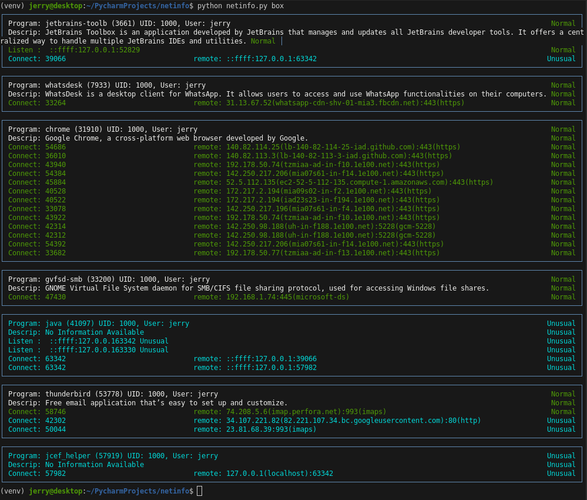

# netinfo
Watch You local network usage comparing it against what is Normal.

The idea is to watch you network in real time and match the current network pattern against a predefined pattern.  In this way we can Identify when your system attempts something different.

## Here an example run

## Explanation of the Example
1. The programs NetworkManager, postgres, cupsd, systemd-resolve, sshd, and chrome are all using the network as expected.
2. The program jcef_helper has no description in program_info.json and therefore is considered not to conform to Normal operations.

## Next Steps
1. Increase the number of programs in program_info.json.  
    **Note:** that this is easily done by setting up a chatGPT session to which you copy the undefined program section, and ask chatGPT to update the program_info.json
2. Create a realtime version that constantly watches for unknown network processing.
3. Investigate what similar static program definitions exists.